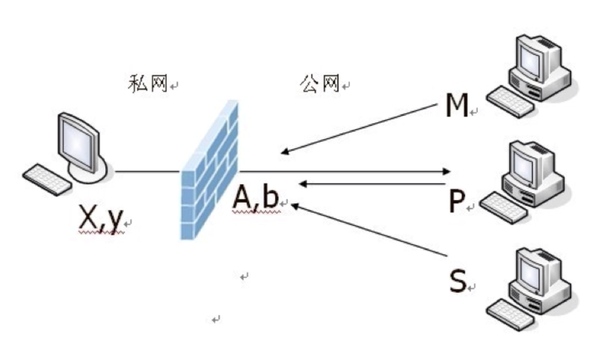
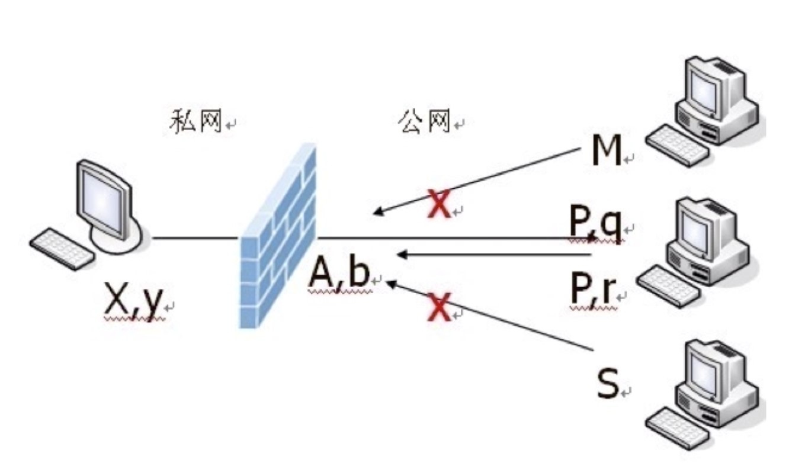
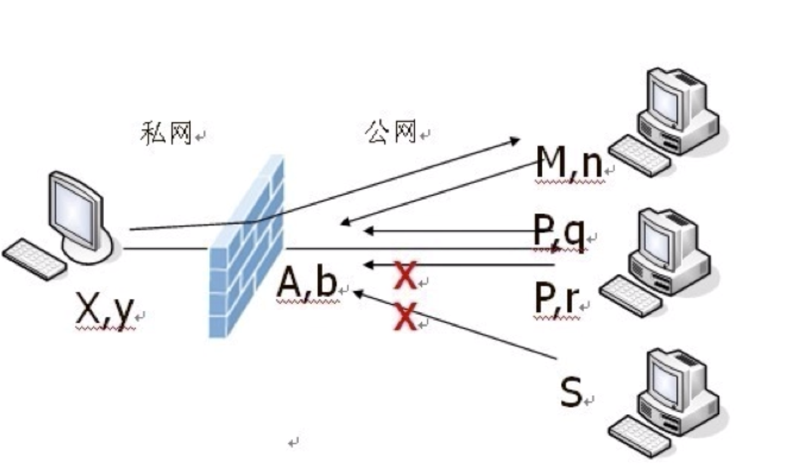
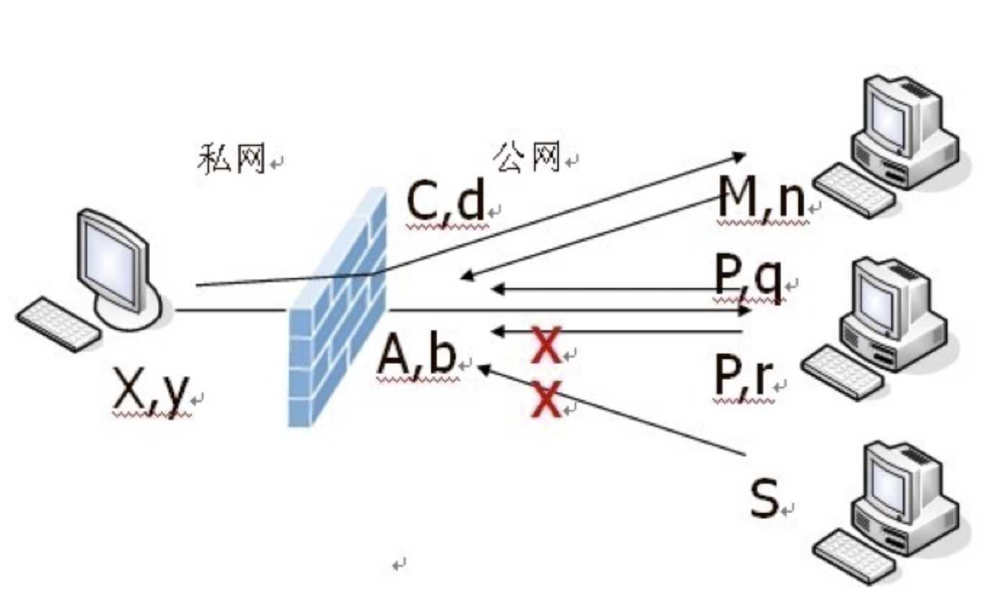

### NAT 类型

##### 完全锥型 NAT

```
如上图所示 内网地址和端口 (X,y) 请求公网主机，NAT 服务会为内网主机映射公网地址和端口 (A，b)

主机 M P S 均可以可以通过 A，b 跟内网主机(X,y)通讯

这种NAT 类型十分容易穿越，当然安全性也不好。
```
##### 地址限制锥型 NAT


```
如上图所示，这种类型的NAT服务的映射记录会形成五元组(X,y,A,b,P) 也就是
内网地址和端口，公网 ip 地址和端口，公网主机的 ip
这种类型的NAT 只有 p 这台主机可以与内网主机通讯,这里 P 可以使用不同的端口与内网主机通讯
```
##### 端口限制锥型 NAT


```
这种类型的nat 不仅限制地址，还限制端口
```
##### 对称限制型 NAT


```
这种类型的NAT 针对不同的公网主机会生成不同的ip和端口对，只有对应的公网主机地址和端口才可以和内网主机通讯
```

### NAT  穿越原理
```
假设C1 和 C2 进行互通

c1 和 c2 互通的前提是 c1 要知道 c2的地址，c2 要知道 c1 的地址

为了知道地址信息， c1 和 c2 需要向 STUN 服务发送消息，

STUN 服务收到请求后，就知道了 c1 c2 的公网 ip 地址和端口

然后将c1 的 ip 和 端口 与c2 交换

```
